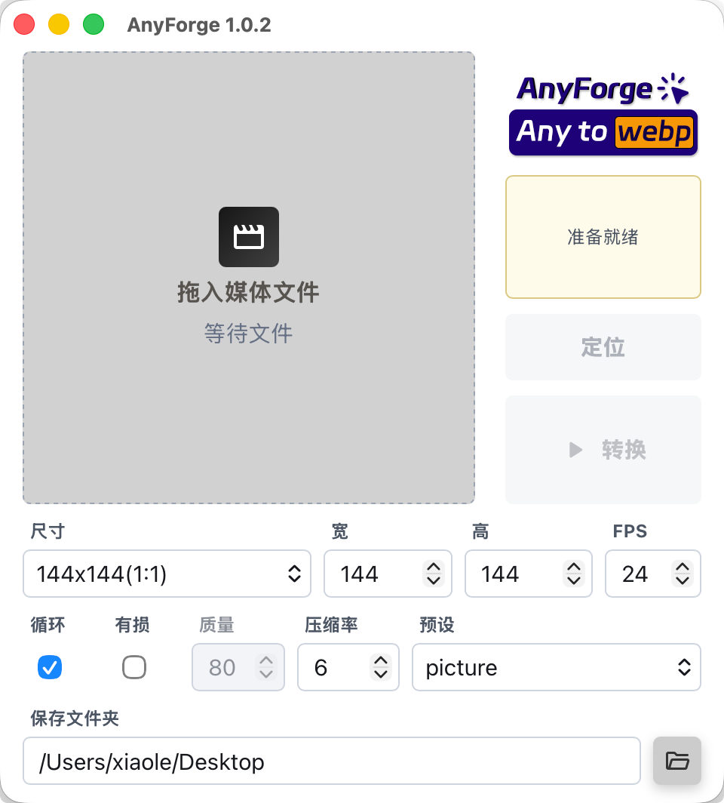

<h1 align="center">AnyForge</h1>

<p align="center">
  <sub>一个安静、小巧的 macOS 媒体转换工具 · Any input to GIF / WebP · powered by ffmpeg</sub>
</p>

<p align="center">
  
  
  
  
  
</p>

## 简介

AnyForge 是一个本机媒体转换小工具。把 MP4、GIF、WebP、PNG、JPG 或其他 `ffmpeg` 能读的文件拖进去，选择输出为 GIF 或 WebP，设置尺寸、FPS 和压缩参数，然后得到一个适合聊天、文档、网页或素材库使用的小文件。

它不做大而全的媒体工作台，只专心做好一件事：把常见素材快速锻造成 GIF / WebP。

## 功能

- 支持 `ffmpeg` 可读取的输入格式，包括 MP4、GIF、WebP、PNG、JPG 等；
- 输出 GIF 和 WebP，右上角 app 2 合 1 Logo，随时切换输出格式；
- 预览显示关键媒体参数：类型、尺寸和 FPS；
- WebP 支持循环、有损/无损、质量、压缩等级和 preset。
- GIF 使用 palettegen / paletteuse 流程，保留更干净的颜色效果。
- 静态图片单帧转换，不写 WebP 和 GIF 动画信息，瘦身更合理；
- 任意指定输出文件夹，转换完成一键在 Finder 里定位生成文件。

## 界面

<p align="center">
  
  
</p>

## 使用

1. 运行 AnyForge；
2. 把媒体文件拖进预览区，选择输出格式。
3. 确认参数，点击“转换”，点击“定位”找到文件。

## 输出参数

- FPS：每秒帧数，越高越流畅；
- 有损：可定义质量，通常 60 - 80 之间为可接受质量；
- 压缩等级：不影响质量，只影响压缩率，6 为最高；
- preset：ffmpeg 内部针对不同内容的内容的优化；
- 静态图片只生成单帧内容，不加入 FPS / loop 这类信息。

## 环境要求

- macOS （Tarui 支持，但楼主没有 Windows / Linux 机器楼主无法编译其它发行包）；
- 本机需预装全局可访问的 `ffmpeg`（如果为便携版，同时需要 `ffprobe`）。

用以下命令检查环境是否满足要求：

```bash
ffmpeg -version
ffprobe -version
```

如果没有安装，可以使用 Homebrew：

```bash
brew install ffmpeg
```

## 开发

安装依赖：

```bash
pnpm install
```

启动开发模式：

```bash
pnpm tauri dev
```

生成前端静态文件：

```bash
pnpm build
```

运行 Rust 测试：

```bash
cargo test --manifest-path src-tauri/Cargo.toml
```

打包 macOS App 和 DMG：

```bash
pnpm tauri build
```

打包后的文件会生成在 Tauri 的 bundle 目录。项目维护时会把可分发的 `.app` 和 `.dmg` 放到 git 忽略的 `release/` 目录中，并在文件名里带上版本号。

## 版本号

发布或打包前，请保持这些文件里的版本一致：

- `package.json`
- `src-tauri/Cargo.toml`
- `src-tauri/tauri.conf.json`
- `index.html`

修改 `Cargo.toml` 后，运行一次测试或构建会同步更新 `src-tauri/Cargo.lock`：

```bash
cargo test --manifest-path src-tauri/Cargo.toml
```

## 调试日志

运行开发模式时，终端会显示 Tauri / Rust 侧日志和编译错误：

```bash
pnpm tauri dev
```

## 许可证

MIT 许可证，详见 `LICENSE`。
